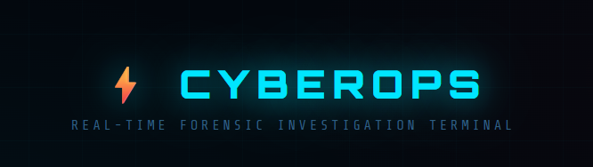

<p align="center">
  
</p>

# ARGUS — Security Operations & Network Telemetry Console

Argus is an advanced, lightweight Security Operations Center (SOC) dashboard and forensics investigation suite. Built with Python and Flask, it simulates real-world threat hunting, packet analysis, and intrusion detection workflows.

This repository is optimized to deploy immediately as a **Hugging Face Docker Space** or on local machines.

> **Live Deployment Note:** When hosted in cloud containers (like Hugging Face Spaces), low-level system hooks are restricted (Linux environment has no Windows Event logs, and root privileges for Scapy sniffing are blocked). Argus solves this by automatically engaging a **real-time simulation engine** that streams realistic attack telemetry so recruiters and viewers can interact with the app immediately without any local setup.

---

## 🔍 Recruiter & Viewer Verification Guide

If you are a recruiter reviewing this project, you can use the following sample inputs to test every tool in the console.

### 🔑 Step 0: Authentication
1. Click **Access Terminal** on the home page.
2. Log in using the demo analyst credentials:
   - **Username:** `admin`
   - **Password:** `admin@123`

---

### 📡 1. Port Scanner
*Demonstrates multi-threaded socket connections and service fingerprinting.*
1. Select the **Port Scanner** module.
2. Enter target hostname: `scanme.nmap.org` (or `127.0.0.1` for local loopback).
3. Set scan mode to **Common ports (fast)** and click **Start Scan**.
4. **Result:** Resolves the IP address, queries ports concurrently, maps running protocols (HTTP, SSH, etc.), and displays exposure risk badges.

---

### 📊 2. Network Sniffer
*Demonstrates OSI layer decoding, payload inspection, and pattern-based threat alerts.*
1. Select the **Network Sniffer** module.
2. Choose your network interface (or select `Simulated Loopback Adapter` if running in container mode).
3. Click **Start Sniffing**.
4. **Result:** Packets will begin streaming in. Watch for **crimson red flagged alerts** that capture threat signatures like SQL injections (`UNION SELECT`), Cross-Site Scripting (`<script>`), and path traversals (`../../etc/passwd`). 
5. Click **Show Threats Only** to filter the stream.

---

### 🔐 3. Auth Log Auditor
*Demonstrates Windows Event Log analysis, forensic timelines, and brute force detection.*
1. Select **Auth Log** module.
2. **Result:** Audits login records, isolates brute-forcing sources, and maps log spikes. 
3. *Note: If running in container mode, Argus automatically simulates a live brute-force attack from `185.220.101.5` (12 failed login hits) and `109.236.80.12` to populate the timelines.*

---

### 🔬 4. IP Threat Intel
*Demonstrates external database API queries, local blacklist configurations, and custom caches.*
1. Select the **Threat Intel** module.
2. Query any of these IPs to verify reputation filters:
   - `185.220.101.0` (Triggers local policy: *Tor Exit Node*)
   - `91.108.4.0` (Triggers local policy: *Known botnet C2*)
   - `8.8.8.8` (Google DNS - returns clean status)
3. **Result:** Generates an evaluation report detailing Abuse Confidence ratings, reports count, ISP origin, and Tor Exit Node status.

---

### ⚡ 5. IoC Threat Extractor
*Demonstrates regex-based parsing and extraction algorithms.*
1. Select the **IoC Extractor** module.
2. Copy and paste the following threat advisory block:
   ```text
   WARNING: Host compromise detected on system 192.168.1.100.
   Incident responders found active Conti and Emotet ransomware strains.
   The server initiated connection to C2 node 203.0.113.99.
   Malicious downloader signature matches file MD5 hash: 5d41402abc4b2a76b9719d911017c592
   Stolen files are exfiltrated to hostnames: update-server.tk, backdoor-dns.ml
   ```
3. Click **Extract**.
4. **Result:** Argus parses, deduplicates, and structures files, hashes, IP addresses, domains, and malware families, providing an overall threat verdict.

---

### 🌐 6. URL Web Scraper
*Demonstrates BeautifulSoup HTML parsing, text sanitization, and pipeline integration.*
1. Select the **URL Web Scraper** module.
2. Enter: `https://scanme.nmap.org` (or any public security news page).
3. Click **Scan**.
4. **Result:** Argus crawls the URL, removes script/style noise, strips layout tags, and feeds the plain text to the IoC parser to map vulnerabilities.

---

### 🛡️ 7. Credential Auditor
*Demonstrates password policy enforcement and complexity checks.*
1. Select the **Credential Auditor** module.
2. Try the following inputs:
   - `admin123` -> Fails policy checks (WEAK score).
   - `Argus#DefSec!Ops2026` -> Passes checks (STRONG score, 90+/100).

---

### 📰 8. Threat Intel Feed
*Demonstrates Dynamic Web Scraping & News Aggregation.*
1. Select the **Threat Intel Feed** module.
2. Click between feed sources: **The Hacker News**, **BleepingComputer**, or **CISA Alerts**.
3. **Result:** Argus crawls the target homepage (or pulls simulated live articles if connection is firewalled) and maps active security keywords and IP indicators.

---

## 💻 Developer Skills Demonstrated

| Competency | Implementation Location |
| :--- | :--- |
| **Concurrent Programming & Multi-threading** | Scans ports concurrently in `log_scanner.py` using `concurrent.futures.ThreadPoolExecutor` |
| **Object Parsing & Regular Expressions** | Dissects IoCs, IPs, domains, and TLDs in `threat_extractor.py` and `web_scraper.py` |
| **Network Protocol Dissection** | Dissects Ethernet/IP/TCP/UDP packet streams using `Scapy` in `packet_capture.py` |
| **Session State & Security Protocols** | Session tokens, database mocks, brute-force locking, password hashing in `auth_manager.py` |
| **BeautifulSoup Web Crawling** | Fetches URLs, strip stylesheets/scripts, and aggregates text in `web_fetcher.py` and `web_scraper.py` |
| **Interactive Charting & Visuals** | Generates dark-theme timelines, charts, and dials via Plotly in `visualizer.py` |
| **Multi-platform Dockerization** | Multi-stage build layer optimizations, non-root user setups in `Dockerfile` |

---

## ⚙️ Local Installation & Setup

1. **Install Prerequisites**: 
   - Download and install [Npcap](https://npcap.com/#download) (Ensure **WinPcap API-compatible mode** is checked).
   - Start your terminal as **Administrator**.
2. **Install Python Libraries**:
   ```bash
   pip install -r requirements.txt
   ```
3. **Configure AbuseIPDB Key (Optional)**:
   ```bash
   # Windows
   set ABUSEIPDB_KEY=your_key_here
   
   # Linux/macOS
   export ABUSEIPDB_KEY="your_key_here"
   ```
4. **Run Server**:
   ```bash
   python app.py
   ```
   Open **[http://127.0.0.1:7860](http://127.0.0.1:7860)**.

---

## 🚀 Pushing to GitHub & Hugging Face

### 1. Push to GitHub
Initialize git and push to your GitHub repository:
```bash
git init
git add .
git commit -m "Argus Refactor: Clean folder structures, premium dark UI/UX, simulation fallbacks, and recruiter manual"
git branch -M main
git remote add origin https://github.com/ohnogaurav/Argus.git
git push -u origin main --force
```

### 2. Push to Hugging Face Spaces (Docker Blank Space)
1. In your Hugging Face space (`https://huggingface.co/spaces/ohnogaurav/Argus`), grab the Git remote URL.
2. Add Hugging Face as a remote and push:
   ```bash
   git remote add hf https://huggingface.co/spaces/ohnogaurav/Argus
   git push hf main --force
   ```
3. Hugging Face will read the [Dockerfile](file:///c:/Users/gaura/Downloads/CyberOPS-master/CyberOPS-master/Dockerfile) in this repository and automatically deploy it.
